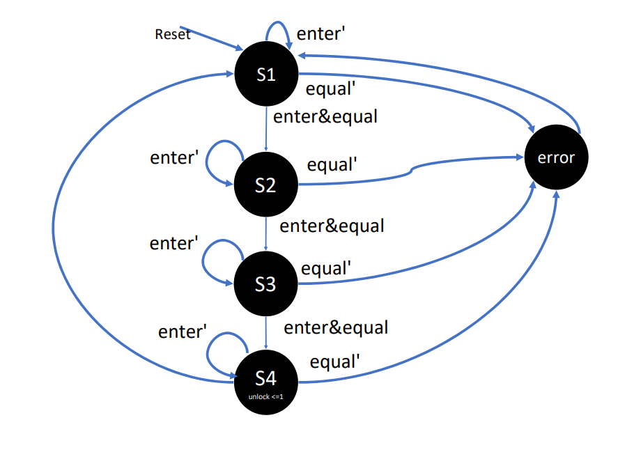

# Digital Combination Locker
The objective of this project is to design a 3 digit combination lock that could be used in a verity of applications. In this instance, it is assumed it would be used to lock a door preventing any entry to the room without the correct code sequence. The lock will be designed using a finite state machine and a synchronous design methodology.  

A finite state machine is very helpful when designing a sequential circuit that has a next state logic. For the designing of the digital combination locker a FSM will allow the transitioning of states each time the operator passes in a value. After comparing each value entered by the operator to the correct code sequence and verifying the two values match, the transitioning of states will occur to verify the next input until the door is unlocked.  A FSM as shown with this application proves to be a very useful tool especially for any application with an event sequence or a pattern. 

To begin with, a derivation of an FSM model or a state diagram will be presented to allow for an overview understanding of the design. The diagram shows the interactions and transitions between the internal states in amore simpler format. 

## Specifications ##

### Requirements ###

* The 3 digit combination lock must allow for a reset button, and an enter button.
* The code sequence can be loaded to the registers given the input values ld1, ld2, ld3. 
* C1, C2, C3 are three registers that hold the lock combination for verification purposes
* The operator must enable enter after entering each key. That will allow for the verification of each value to occur and also move to the next state. 
* The operator can return to a reset setting at any point in time.
* There are two main principle components in the circuit and that is the data path and controller. 
* Only after all 3 digit combination values that are entered by the operator can the door open.  

### Operation ###

* Pressing reset begins the unlocking process.
* The operator is allowed to enter any digit in the keypad to attempt to unlock the door. 
* After entering each digit, the operator will need to enable enter to move to the next state. 
* The value entered is verified and compared to the value stored in the register.
* If successful, the same process will repeat until the third value is entered in which the door will become unlocked. 
*	If an incorrect value is entered by the operator, the 3 digit combinational locker will reset. 
*	For this case, a code sequence of 3, 1, 3 is assumed. 
*	The operator can return to the original state and restart the unlocking attempt by enabling reset. 

## Design ## 
### State Diagram ###

